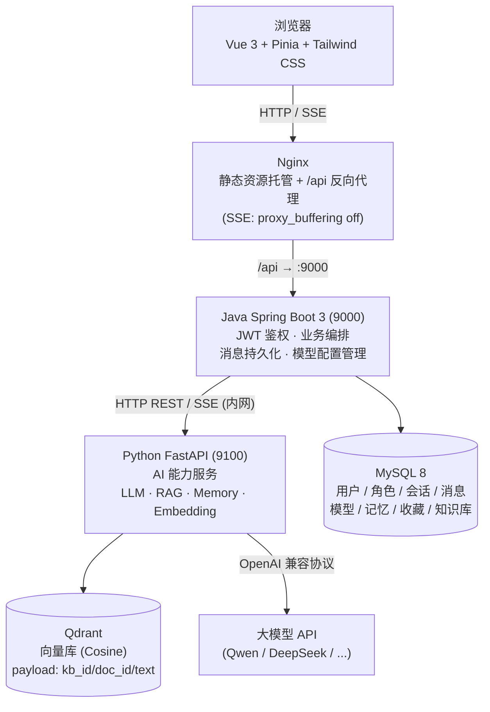
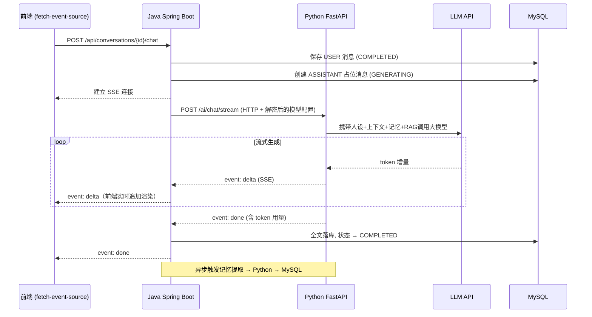
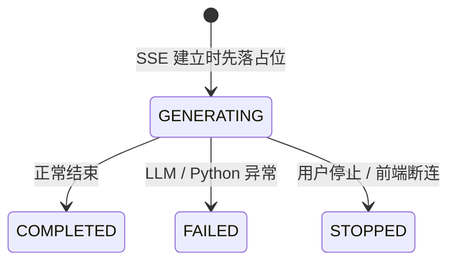
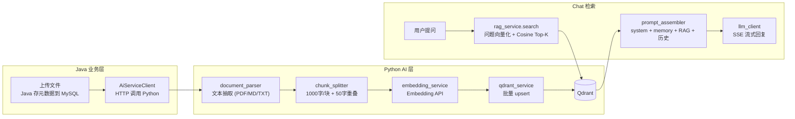

# 心屿 XinYu

> 每个人心里，都有一座岛。

心屿是一款 **Java + Python 多语言架构** 的 AI 对话平台：**Java Spring Boot** 负责业务后端，**Python FastAPI** 负责 AI 能力，通过 **HTTP REST API** 通信。前端基于 **Vue 3**，支持 **SSE 流式聊天、RAG 知识库增强生成、多模型热切换、长期记忆、角色 UGC 广场**，并通过 **Docker Compose 一键部署**（五容器编排）。

```bash
docker compose up -d --build   # 一条命令启动整套系统 → http://localhost
```

## ✨ 功能特性

### 核心聊天
- **SSE 流式回复**：Token 级增量返回，边生成边显示，支持随时停止生成
- **消息状态机**：`GENERATING → COMPLETED / FAILED / STOPPED` 全生命周期管理，中断可容错恢复
- **Markdown 渲染**：代码高亮（highlight.js）、列表、表格，DOMPurify 白名单过滤防御 XSS
- **多轮上下文**：角色 System Prompt + 历史 + 当前输入，服务端组装

### 多模型热切换
- **用户自管理模型**：每个用户可添加任意 OpenAI 兼容模型（Qwen/DeepSeek/GLM/Moonshot/Ollama），API Key 采用 **AES-GCM 加密存储**
- **会话级模型覆盖**：优先级 = 会话级覆盖 > 用户默认模型；聊天顶栏一键切换，无需重新部署
- **Python AI 服务统一调用**：Java 解密 API Key 后传给 Python，由 Python 负责实际 LLM 调用

### 长期记忆系统
- **自动提取**：每轮 ASSISTANT 完成后，异步调用 Python 从对话中提取结构化记忆（JSON 输出 + 容错解析），独立线程池隔离，失败静默不影响主链路
- **Top-K 注入**：按 importance（HIGH/MEDIUM/LOW）权重截断 Top-5，拼接到 system prompt 末尾
- **同 key 去重**：同 (用户, 角色, memory_key) 已有则更新，避免堆积
- **用户可管理**：记忆管理页支持编辑 / 启停 / 删除，按角色筛选

### 角色 UGC 生态
- **角色 CRUD + Prompt 编辑器**：用户自定义人设、开场白、采样温度、maxTokens
- **状态机**：`DRAFT → PUBLISHED → OFFLINE`，草稿仅自己可见，发布后广场可见
- **角色广场**：游客可逛，支持搜索 + 推荐/热门/最新三排序；点击收藏 / 开聊，操作引导登录
- **角色详情页**：模糊头像背景 + 开场白预览 + 悬浮操作栏
- **记忆按 用户 × 角色 隔离**：不同角色不串味

### RAG 知识库增强生成
- **文档上传与向量化**：支持 PDF / Markdown / TXT 三种格式，Python 侧解析后按 1000 字/块（50 字重叠避免切断语义）切片，调用 Embedding 模型批量向量化，存入 **Qdrant** 向量数据库
- **会话绑定知识库**：创建会话时可选绑定一个知识库，不同会话独立挂载
- **Top-K 检索注入**：用户提问时，Python 按问题 embedding 在 Qdrant 中做 Cosine 相似度检索，取 Top-3 且分数 ≥ 0.5 的片段拼接到 system prompt
- **失败降级**：Qdrant 不可用或检索异常时静默降级为普通聊天，不阻断主链路
- **可视化知识库管理**：知识库卡片列表 / 创建抽屉 / 详情抽屉（文档列表 + 上传进度 + 状态机 + 失败原因展示）

### 用户系统
- 注册 / 登录 / JWT 鉴权 / 接口权限校验 / 数据按用户隔离
- 用量统计：调用次数 + Token 消耗 + 估算成本，实时面板

## 🏗 系统架构



**部署形态**：`docker compose up -d` 拉起五个容器 —— `xinyu-nginx`（对外唯一入口 80）→ `xinyu-server`（内部 9000）→ `xinyu-ai`（内部 9100）+ `xinyu-mysql`（内部 3306）+ `xinyu-qdrant`（内部 6333 REST），数据全部持久化于 named volume。

### 为什么要分离成 Java + Python？

| 维度 | Java 适合 | Python 适合 |
|------|-----------|-------------|
| 业务逻辑 | 强类型、事务、安全、稳定 | — |
| AI 生态 | — | LLM/RAG/Embedding 库丰富，开发效率高 |
| 性能要求 | 高并发业务接口 | 计算密集型 AI 调用（IO 等待为主） |
| 迭代速度 | 相对稳定 | 快速试错新模型/新算法 |

分离后 Java 专注业务正确性，Python 专注 AI 能力，各自用最适合的语言和生态。

## 🔄 SSE 流式对话链路



### ASSISTANT 消息状态机



占位先行 + 状态流转的设计保证了**任何异常路径（模型超时、用户断网、主动停止、Python 宕机）都不会产生脏数据**，刷新页面后历史消息始终一致。

## 📚 RAG 知识库链路



**入库**：Java 接收上传 → 存元数据 → 调 Python → Python 解析 → 分块 → Embedding → Qdrant upsert。

**检索**：聊天时 Java 传给 Python `ragKbId` + `userQuery` → Python 负责检索 + 注入 system prompt → LLM 生成。**RAG 失败时静默降级**，聊天链路不受影响。

## 🧰 技术栈

| 层 | 技术 |
|---|---|
| 前端 | Vue 3.5 · TypeScript · Vite · Pinia · Vue Router · Axios · Tailwind CSS 4 · marked + highlight.js + DOMPurify |
| 业务后端 | Java 21 · Spring Boot 3.5 · MyBatis-Plus · JWT (jjwt) · SSE (SseEmitter) · HttpURLConnection |
| AI 服务 | Python 3.10+ · FastAPI · Uvicorn · OpenAI SDK · Qdrant Client · httpx |
| 数据 | MySQL 8（业务元数据） · Qdrant 1.12（向量检索, REST 协议） |
| 模型 | 任意 OpenAI 兼容 API（对话）；Embedding 按默认模型服务商自动映射（通义 / OpenAI / 智谱），可环境变量覆盖 |
| 部署 | Docker Compose · Nginx · 多阶段镜像构建 |

## 🚀 快速开始

### 方式一：Docker 一键部署（推荐）

前置：安装 [Docker Desktop](https://www.docker.com/products/docker-desktop/)（或 Linux 下 Docker Engine + Compose 插件）。

```bash
# 1. 准备环境变量（数据库密码 / JWT 密钥）
cp .env.example .env   # Windows: copy .env.example .env
#    编辑 .env 填入数据库密码和 JWT 密钥

# 2. 一键构建并启动（首次构建需拉取基础镜像, 约 3~5 分钟）
docker compose up -d --build

# 3. 浏览器打开
http://localhost
```

MySQL 首次启动自动执行 `deploy/mysql/init/01-schema.sql`（建表 + 官方角色种子数据），无需手动建库。停止：`docker compose down`（数据保留在 named volume）。

> 登录后进入「模型管理」添加你的 AI 模型（API Key），设为默认模型即可开始聊天。

### 方式二：本地开发模式

开发环境使用 `dev` profile。

```bash
# 1. Python AI 服务（端口 9100）
cd xinyu-ai
pip install -r requirements.txt
python -m uvicorn app.main:app --host 0.0.0.0 --port 9100 --reload

# 2. Java 后端（端口 9000，需本机 MySQL 8）
cd xinyu-server
mvn spring-boot:run -Dspring-boot.run.profiles=dev

# 3. 前端（/api 自动代理到 9000）
cd xinyu-web
npm install
npm run dev   # :5173
```

浏览器访问 `http://localhost:5173`。

## 📁 项目结构

```
xinyu/
├── xinyu-web/            前端（Vue3 + TS + Vite, 含 Dockerfile: Node 构建 → Nginx 托管）
├── xinyu-server/         业务后端（Spring Boot 3 + Java 21, 含 Dockerfile）
│   └── src/main/java/com/xinyu/
│       ├── auth/         注册登录 + JWT 签发校验
│       ├── chat/         聊天编排（ChatService / ContextAssembler / SSE 转发）
│       ├── llm/          AiServiceClient (Java→Python HTTP) + 模型配置管理
│       ├── memory/       长期记忆（Java 存 MySQL, 提取调用 Python）
│       ├── character/    角色 UGC（CRUD + 状态机 + 广场 + 收藏）
│       ├── rag/          RAG 知识库（Java 存元数据 + 调 Python 处理向量）
│       ├── conversation/ 会话管理
│       ├── message/      消息持久化 + 状态机
│       ├── stats/        用量统计
│       └── common/       安全（AES / JWT / 鉴权过滤器）+ 异常 + 配置
├── xinyu-ai/             AI 服务（Python + FastAPI, 含 Dockerfile）
│   └── app/
│       ├── routers/      API 路由（chat / memory / rag）
│       ├── services/     业务逻辑（llm_client / rag_service / embedding_service / ...）
│       ├── core/         异常定义
│       ├── models.py     Pydantic 数据模型
│       ├── config.py     配置
│       └── main.py       FastAPI 入口
├── nginx/nginx.conf      反向代理配置（SSE 关闭缓冲 / SPA fallback / 静态资源缓存）
├── deploy/mysql/init/    容器 MySQL 自动初始化脚本（建表 + 种子数据）
├── docker-compose.yml    五容器编排（web / backend / ai / mysql / qdrant）
├── .env.example          环境变量模板
└── docs/                 设计文档 + 截图
```

## 🔌 API 概览

### 前端 → Java（业务 API）

| 方法 | 路径 | 说明 |
|---|---|---|
| POST | `/api/auth/register` | 注册（成功即签发 JWT） |
| POST | `/api/auth/login` | 登录 |
| GET | `/api/users/me` | 当前用户信息 |
| GET / POST | `/api/conversations` | 会话列表 / 创建会话 |
| PUT | `/api/conversations/{id}/title` | 修改会话名称 |
| GET | `/api/conversations/{id}/messages` | 历史消息 |
| POST | `/api/conversations/{id}/chat` | 发送消息并建立 **SSE 流式**回复 |
| GET / POST / PUT / DELETE | `/api/models` | 模型 CRUD（用户自管理） |
| PUT | `/api/conversations/{id}/model` | 会话级模型覆盖 |
| GET / PUT / DELETE | `/api/memories` | 长期记忆管理 |
| GET / POST / PUT / DELETE | `/api/characters` | 角色 CRUD |
| GET | `/api/characters/square` | 角色广场（游客可访问） |
| POST / DELETE | `/api/characters/{id}/favorite` | 收藏 / 取消收藏 |
| GET / POST / DELETE | `/api/knowledge-bases` | 知识库 CRUD |
| GET | `/api/knowledge-bases/{id}` | 知识库详情（含文档列表） |
| POST | `/api/knowledge-bases/{id}/documents` | 上传文档（Java 转发 Python 处理） |
| DELETE | `/api/knowledge-bases/{id}/documents/{docId}` | 删除文档（元数据 + 向量级联） |
| GET | `/api/stats/usage` | 用量统计 |

除 `/api/auth/**`、`/api/characters/square`、`/api/characters/*/detail` 外所有接口需携带 `Authorization: Bearer <token>`。

### Java → Python（内部 AI API）

| 方法 | 路径 | 说明 |
|---|---|---|
| POST | `/ai/chat/stream` | SSE 流式聊天 |
| POST | `/ai/memory/extract` | 从对话中提取记忆 |
| POST | `/ai/rag/process` | 处理文档（解析+分块+向量化+入库） |
| POST | `/ai/rag/search` | 向量检索 |
| DELETE | `/ai/rag/vectors` | 删除向量数据 |

## 💡 工程亮点

1. **Java + Python 多语言架构** —— 业务与 AI 能力分离，Java 用强类型保证业务正确性，Python 用丰富的 AI 生态快速迭代，HTTP REST API 解耦，互不影响。
2. **多模型热切换** —— `LlmClientFactory` 负责模型配置管理 + API Key 解密，实际 LLM 调用由 Python AI 服务统一执行，支持任意 OpenAI 兼容模型。
3. **长期记忆系统** —— 每轮对话后异步调用 Python 提取结构化记忆，按 importance Top-K 注入 system prompt；独立线程池隔离，失败静默降级。
4. **角色 UGC 全闭环** —— CRUD + 状态机 + 广场搜索 + 收藏，记忆按 用户×角色 隔离不串味。
5. **RAG 检索增强生成** —— 完整的 RAG 管道在 Python 侧：文档解析 → 分块 → Embedding → Qdrant 存储 → 检索 → 注入；Java 只负责元数据和转发，职责清晰。
6. **SSE 全链路打通** —— Python `StreamingResponse` → Java `SseEmitter` 转发 → Nginx `proxy_buffering off` → 前端 `fetch-event-source` 增量消费，四层协同。
7. **消息状态机容错** —— ASSISTANT 消息先落 `GENERATING` 占位再生成，异常/停止路径均有终态，杜绝半途中断产生的脏数据。
8. **AI 输出安全** —— 模型输出视为不可信输入：marked 渲染 → DOMPurify 白名单过滤 → v-html 展示。

## 📄 更多文档

- [架构审查报告](docs/architecture-review.html)
