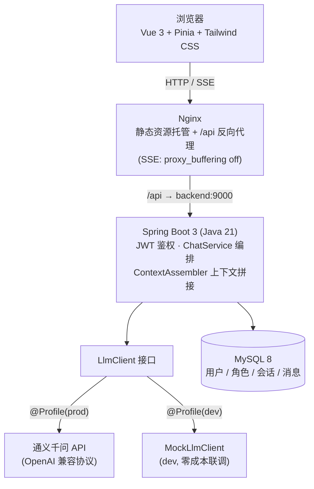
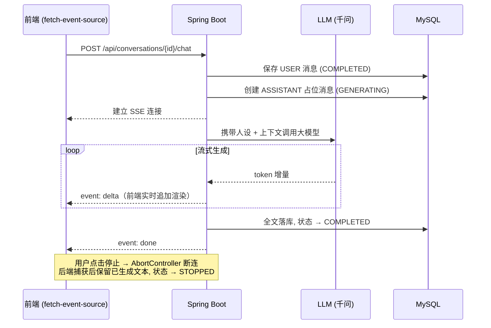
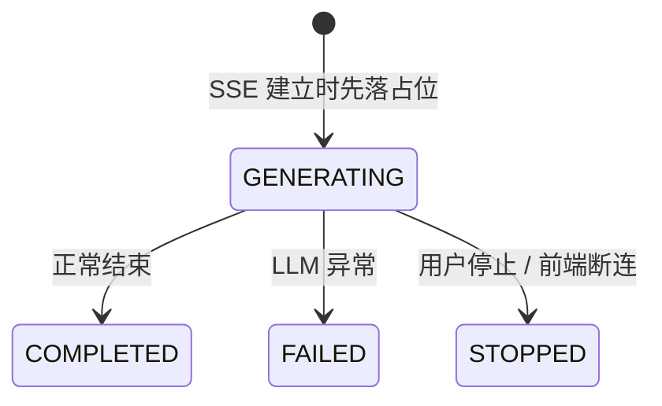

# 心屿 XinYu

> 每个人心里，都有一座岛。

心屿是一款基于 **Spring Boot 3 + Vue 3 + 大语言模型** 的原创 AI 角色聊天平台，支持 **SSE 流式回复、多轮上下文、Markdown 渲染、消息状态机管理**，并通过 **Docker Compose 一键部署**（Nginx + Spring Boot + MySQL 三容器编排）。

```bash
docker compose up -d --build   # 一条命令启动整套系统 → http://localhost
```

## ✨ 功能特性

- **用户系统**：注册 / 登录 / JWT 鉴权 / 接口权限校验 / 数据按用户隔离
- **AI 角色聊天**：与官方角色「屿屿」多轮对话，自动携带人设与上下文
- **SSE 流式回复**：Token 级增量返回，边生成边显示，支持随时停止生成
- **消息状态机**：`GENERATING → COMPLETED / FAILED / STOPPED` 全生命周期管理，中断可容错恢复
- **Markdown 渲染**：AI 回复支持代码高亮（highlight.js）、列表、表格，DOMPurify 白名单过滤防御 XSS
- **多模型扩展**：`LlmClient` 接口抽象，Mock（开发）与通义千问（生产）按 Spring Profile 切换，可平滑替换任意 OpenAI 兼容模型

## 📸 界面预览

**聊天主界面**：三栏布局 · SSE 流式回复 · Markdown 代码高亮 / 表格 / 列表渲染


| 登录页 | XSS 防御（恶意脚本被净化为纯文本） |
|---|---|
|  |  |

## 🏗 系统架构



**部署形态**：`docker compose up -d` 拉起三个容器 —— `xinyu-nginx`（对外唯一入口 80）→ `xinyu-server`（内部 9000，不暴露宿主机）→ `xinyu-mysql`（内部 3306，数据持久化于 named volume，首启自动执行建表+种子脚本）。

## 🔄 SSE 流式对话链路



### ASSISTANT 消息状态机



占位先行 + 状态流转的设计保证了**任何异常路径（模型超时、用户断网、主动停止）都不会产生脏数据**，刷新页面后历史消息始终一致。

## 🧰 技术栈

| 层 | 技术 |
|---|---|
| 前端 | Vue 3.5 · TypeScript · Vite · Pinia · Vue Router · Axios · Tailwind CSS 4 · marked + highlight.js + DOMPurify |
| 后端 | Java 21 · Spring Boot 3.5 · MyBatis-Plus · JWT (jjwt) · SSE (SseEmitter) |
| 数据 | MySQL 8 |
| 模型 | 通义千问 qwen-plus（OpenAI 兼容协议），接口抽象支持多供应商扩展 |
| 部署 | Docker Compose · Nginx · 多阶段镜像构建（Maven / Node 构建层 + 轻量运行层） |

## 🚀 快速开始

### 方式一：Docker 一键部署（推荐）

前置：安装 [Docker Desktop](https://www.docker.com/products/docker-desktop/)（或 Linux 下 Docker Engine + Compose 插件）。

```bash
# 1. 准备环境变量（数据库密码 / JWT 密钥 / 千问 API Key）
cp .env.example .env   # Windows: copy .env.example .env
#    编辑 .env 填入三个值, API Key 到阿里云百炼申请: https://bailian.console.aliyun.com/

# 2. 一键构建并启动（首次构建需拉取基础镜像, 约 3~5 分钟）
docker compose up -d --build

# 3. 浏览器打开
http://localhost
```

MySQL 首次启动自动执行 `deploy/mysql/init/01-schema.sql`（10 张表 + 官方角色种子数据），无需手动建库。停止：`docker compose down`（数据保留在 named volume）。

### 方式二：本地开发模式

开发环境使用 `dev` profile，LLM 为 Mock 实现（**无需 API Key，零成本联调**）。

```bash
# 后端（需本机 MySQL 8, 参照 application-example.yml 建 application-dev.yml）
cd xinyu-server && mvn spring-boot:run -Dspring-boot.run.profiles=dev   # :9000

# 前端（/api 自动代理到 9000）
cd xinyu-web && npm install && npm run dev                              # :5180
```

## 📁 项目结构

```
xinyu/
├── xinyu-web/            前端（Vue3 + TS + Vite, 含 Dockerfile: Node 构建 → Nginx 托管）
├── xinyu-server/         后端（Spring Boot 3 + Java 21, 含 Dockerfile: Maven 构建 → JRE 运行）
│   └── src/main/java/com/xinyu/
│       ├── auth/         注册登录 + JWT 签发校验
│       ├── chat/         聊天编排（ChatService / ContextAssembler / SSE）
│       ├── llm/          LlmClient 抽象 + Qwen/Mock 双实现
│       ├── conversation/ 会话管理
│       └── message/      消息持久化 + 状态机
├── nginx/nginx.conf      反向代理配置（SSE 关闭缓冲 / SPA fallback / 静态资源缓存）
├── deploy/mysql/init/    容器 MySQL 自动初始化脚本（建表 + 种子数据）
├── docker-compose.yml    三容器编排（nginx / backend / mysql）
├── .env.example          环境变量模板
└── docs/                 设计文档 + 截图
```

## 🔌 API 概览

| 方法 | 路径 | 说明 |
|---|---|---|
| POST | `/api/auth/register` | 注册（成功即签发 JWT） |
| POST | `/api/auth/login` | 登录 |
| GET | `/api/users/me` | 当前用户信息 |
| GET / POST | `/api/conversations` | 会话列表 / 创建会话 |
| GET | `/api/conversations/{id}/messages` | 历史消息 |
| POST | `/api/conversations/{id}/chat` | 发送消息并建立 **SSE 流式**回复 |

除 `/api/auth/**` 外所有接口需携带 `Authorization: Bearer <token>`。

## 💡 工程亮点

1. **LLM 供应商解耦** —— 业务层只依赖 `LlmClient` 接口，`@Profile` 装配 Mock/千问实现；更换 OpenAI/DeepSeek 等供应商只需新增一个实现类，业务代码零改动。
2. **SSE 全链路打通** —— 后端 `SseEmitter` 异步输出、Nginx `proxy_buffering off` 防缓冲截流、前端 `fetch-event-source` 增量消费（支持 POST + 自定义请求头的 SSE）+ `AbortController` 停止生成，三层协同。
3. **消息状态机容错** —— ASSISTANT 消息先落 `GENERATING` 占位再生成，异常/停止路径均有终态，杜绝半途中断产生的脏数据。
4. **AI 输出安全** —— 将模型输出视为不可信输入：marked 渲染 → DOMPurify 白名单过滤 → v-html 展示，实测恶意 `<script>`/`onerror` payload 均被净化。
5. **镜像安全与效率** —— 多阶段构建减小体积；`.dockerignore` 排除含密钥的本地配置文件，敏感信息全部经环境变量注入（`.env` 不入库）；MySQL/后端容器不暴露宿主机端口，Nginx 为唯一入口。

## 📄 更多文档

- [技术设计文档](docs/design.md)
- [M1-4 前后端接口契约](docs/m1-4-contract.md)
