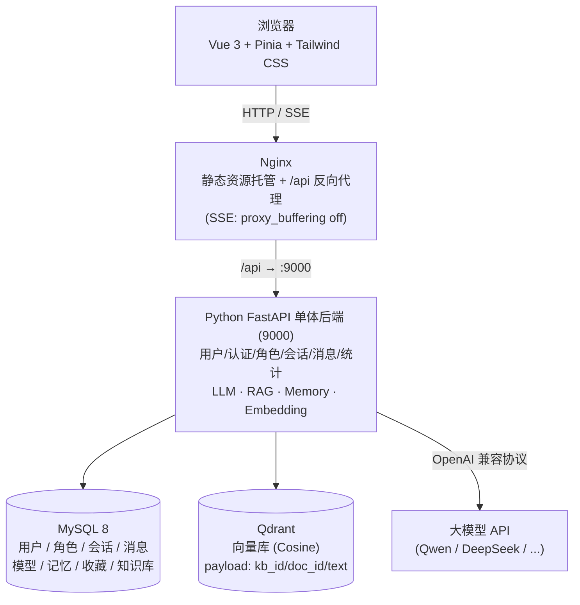
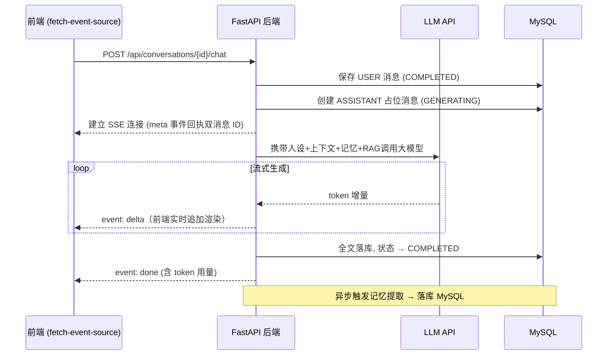
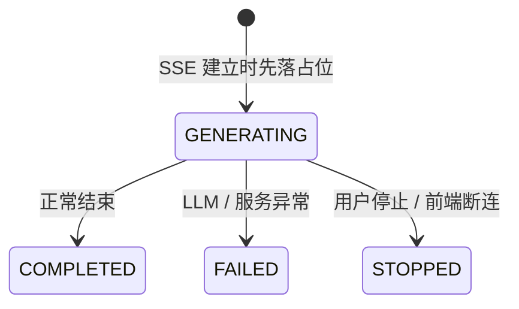
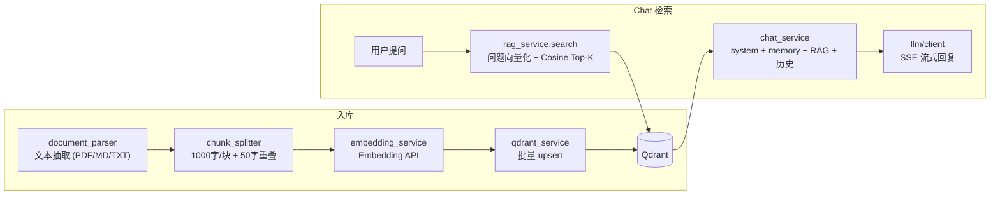

# 心屿 XinYu

> 每个人心里，都有一座岛。

心屿是一款 **Python FastAPI 单体后端** 架构的 AI 对话平台：业务后端与 AI 能力统一在 **Python FastAPI** 中实现（架构重构前的 Java Spring Boot 业务层 + 独立 Python AI 服务已合并）。前端基于 **Vue 3**，支持 **SSE 流式聊天、RAG 知识库增强生成、多模型热切换、长期记忆、角色 UGC 广场**，并通过 **Docker Compose 一键部署**（四容器编排）。

```bash
docker compose up -d --build   # 一条命令启动整套系统 → http://localhost
```

## ✨ 功能特性

### 核心聊天
- **SSE 流式回复**：Token 级增量返回，边生成边显示，支持随时停止生成
- **消息状态机**：`GENERATING → COMPLETED / FAILED / STOPPED` 全生命周期管理，中断可容错恢复
- **Markdown 渲染**：代码高亮（highlight.js）、列表、表格，DOMPurify 白名单过滤防御 XSS
- **多轮上下文**：角色 System Prompt + 历史 + 当前输入，服务端组装

### 多模型热切换
- **用户自管理模型**：每个用户可添加任意 OpenAI 兼容模型（Qwen/DeepSeek/GLM/Moonshot/Ollama），API Key 采用 **AES-GCM 加密存储**
- **会话级模型覆盖**：优先级 = 会话级覆盖 > 用户默认模型；聊天顶栏一键切换，无需重新部署
- **进程内直调**：后端解密 API Key 后由同一进程内的 LLM 客户端直接调用，无跨服务 HTTP 开销

### 长期记忆系统
- **自动提取**：每轮 ASSISTANT 完成后，异步任务从对话中提取结构化记忆（JSON 输出 + 容错解析），失败静默不影响主链路
- **Top-K 注入**：按 importance（HIGH/MEDIUM/LOW）权重截断 Top-5，拼接到 system prompt 末尾
- **同 key 去重**：同 (用户, 角色, memory_key) 已有则更新，避免堆积
- **用户可管理**：记忆管理页支持编辑 / 启停 / 删除，按角色筛选

### 角色 UGC 生态
- **角色 CRUD + Prompt 编辑器**：用户自定义人设、开场白、采样温度、maxTokens
- **状态机**：`DRAFT → PUBLISHED → OFFLINE`，草稿仅自己可见，发布后广场可见
- **角色广场**：游客可逛，支持搜索 + 推荐/热门/最新三排序；点击收藏 / 开聊，操作引导登录
- **角色详情页**：模糊头像背景 + 开场白预览 + 悬浮操作栏
- **记忆按 用户 × 角色 隔离**：不同角色不串味

### RAG 知识库增强生成
- **文档上传与向量化**：支持 PDF / Markdown / TXT 三种格式，解析后按 1000 字/块（50 字重叠避免切断语义）切片，调用 Embedding 模型批量向量化，存入 **Qdrant** 向量数据库
- **会话绑定知识库**：创建会话时可选绑定一个知识库，不同会话独立挂载
- **Top-K 检索注入**：用户提问时，按问题 embedding 在 Qdrant 中做 Cosine 相似度检索，取 Top-3 且分数 ≥ 0.5 的片段拼接到 system prompt
- **失败降级**：Qdrant 不可用或检索异常时静默降级为普通聊天，不阻断主链路
- **可视化知识库管理**：知识库卡片列表 / 创建抽屉 / 详情抽屉（文档列表 + 上传进度 + 状态机 + 失败原因展示）

### 用户系统
- 注册 / 登录 / JWT 鉴权 / 接口权限校验 / 数据按用户隔离
- 用量统计：调用次数 + Token 消耗 + 估算成本，实时面板

## 🏗 系统架构



**部署形态**：`docker compose up -d` 拉起四个容器 —— `xinyu-nginx`（对外唯一入口 80）→ `xinyu-backend`（内部 9000, FastAPI 单体）+ `xinyu-mysql`（内部 3306）+ `xinyu-qdrant`（内部 6333 REST），数据全部持久化于 named volume。

### 为什么合并成 Python 单体？

| 维度 | 双服务架构的问题 | 单体后的收益 |
|------|----------------|-------------|
| 部署复杂度 | 两套镜像/依赖/健康检查 | 一个镜像、一条链路 |
| 调用链路 | Java→Python HTTP 中转（SSE 双层转发、超时叠加） | 进程内直调，链路减半 |
| 数据一致性 | 聊天事务跨两个服务，失败补偿复杂 | 单库单事务 |
| 迭代速度 | 跨语言改一个功能要动两处 | Pydantic + SQLAlchemy 全链路类型安全 |

业务与 AI 能力同属一个进程，通过 `api / services / repositories / ai` 分层保持职责清晰；数据库结构与 API 契约和原 Java 版完全兼容，存量数据无缝迁移。

## 🔄 SSE 流式对话链路



### ASSISTANT 消息状态机



占位先行 + 状态流转的设计保证了**任何异常路径（模型超时、用户断网、主动停止）都不会产生脏数据**，刷新页面后历史消息始终一致。

## 📚 RAG 知识库链路



**入库**：接收上传 → 元数据落 MySQL → 解析 → 分块 → Embedding → Qdrant upsert。

**检索**：聊天时按会话绑定的 `kb_id` + 用户问题做检索 + 注入 system prompt → LLM 生成。**RAG 失败时静默降级**，聊天链路不受影响。

## 🧰 技术栈

| 层 | 技术 |
|---|---|
| 前端 | Vue 3.5 · TypeScript · Vite · Pinia · Vue Router · Axios · Tailwind CSS 4 · marked + highlight.js + DOMPurify |
| 后端 | Python 3.12 · FastAPI · Pydantic · SQLAlchemy 2.x (async) · PyJWT · bcrypt · httpx |
| AI 能力 | OpenAI SDK · Qdrant Client · PyMuPDF（同进程, 无跨服务调用） |
| 数据 | MySQL 8（业务元数据） · Qdrant 1.12（向量检索, REST 协议） |
| 模型 | 任意 OpenAI 兼容 API（对话）；Embedding 按默认模型服务商自动映射（通义 / OpenAI / 智谱），可环境变量覆盖 |
| 部署 | Docker Compose · Nginx · Uvicorn |

## 🚀 快速开始

### 方式一：Docker 一键部署（推荐）

前置：安装 [Docker Desktop](https://www.docker.com/products/docker-desktop/)（或 Linux 下 Docker Engine + Compose 插件）。

```bash
# 1. 准备环境变量（数据库密码 / JWT 密钥）
cp .env.example .env   # Windows: copy .env.example .env
#    编辑 .env 填入数据库密码和 JWT 密钥

# 2. 一键构建并启动（首次构建需拉取基础镜像, 约 3~5 分钟）
docker compose up -d --build

# 3. 浏览器打开
http://localhost
```

MySQL 首次启动自动执行 `scripts/schema.sql`（建表，唯一结构来源）+ `scripts/seed-core.sql`（官方角色屿屿），无需手动建库。停止：`docker compose down`（数据保留在 named volume）。

> 登录后进入「模型管理」添加你的 AI 模型（API Key），设为默认模型即可开始聊天。

### 方式二：本地开发模式

```bash
# 1. 后端（端口 9000，需本机 MySQL 8；环境变量见 app/core/config.py）
cd xinyu-backend
python -m venv .venv
.venv\Scripts\activate          # Windows
pip install -r requirements.txt
set XINYU_ENV=dev               # dev 环境: 未配置模型时降级 mock
set XINYU_DB_PASSWORD=<你的MySQL密码>
python -m uvicorn app.main:app --port 9000 --reload

# 运行单元测试（安全兼容性 / 雪花ID / 分块器）
python -m unittest discover -s tests -v

# 2. 前端（/api 自动代理到 9000）
cd xinyu-web
npm install
npm run dev   # :5173
```

浏览器访问 `http://localhost:5173`。

## 📁 项目结构

```
xinyu/
├── xinyu-web/            前端（Vue3 + TS + Vite, 含 Dockerfile: Node 构建 → Nginx 托管）
├── xinyu-backend/        Python 单体后端（FastAPI, 含 Dockerfile + 单元测试）
│   ├── app/
│   │   ├── api/          路由层（auth / users / characters / conversations / messages / memories / models / knowledge_bases / stats）
│   │   ├── services/     业务逻辑（chat_service 聊天编排 / auth / character / memory / knowledge / stats / ...）
│   │   ├── repositories/ 数据访问层（SQLAlchemy 查询, 对应原 MyBatis-Plus Mapper）
│   │   ├── models/       SQLAlchemy 实体（与 MySQL 表一一对应）
│   │   ├── schemas/      Pydantic 请求/响应模型（对应原 Java DTO/VO）
│   │   ├── ai/           AI 能力层（llm / rag / memory / prompt, 进程内调用）
│   │   ├── core/         配置 / 安全（JWT / AES-GCM / BCrypt）/ 数据库 / 雪花ID / 异常
│   │   ├── utils/        工具（登录注册限流器）
│   │   └── main.py       FastAPI 入口（路由组装 + 全局异常处理）
│   └── tests/            单元测试（安全跨语言兼容性 / 雪花ID / 分块器）
├── nginx/nginx.conf      反向代理配置（SSE 关闭缓冲 / SPA fallback / 静态资源缓存）
├── scripts/              SQL 脚本（schema.sql 结构唯一来源 / seed-core.sql 官方角色 / seed-dev.sql 开发数据）
├── docker-compose.yml    四容器编排（nginx / backend / mysql / qdrant）
├── .env.example          环境变量模板
└── docs/                 设计文档 + 契约文档 + 讲解文档 + 截图
```

## 🔌 API 概览

### 前端 → 后端（业务 API）

| 方法 | 路径 | 说明 |
|---|---|---|
| POST | `/api/auth/register` | 注册（成功即签发 JWT） |
| POST | `/api/auth/login` | 登录 |
| GET | `/api/users/me` | 当前用户信息 |
| GET / POST | `/api/conversations` | 会话列表 / 创建会话 |
| PUT | `/api/conversations/{id}/title` | 修改会话名称 |
| GET | `/api/conversations/{id}/messages` | 历史消息 |
| POST | `/api/conversations/{id}/chat` | 发送消息并建立 **SSE 流式**回复 |
| GET / POST / PUT / DELETE | `/api/models` | 模型 CRUD（用户自管理） |
| PUT | `/api/conversations/{id}/model` | 会话级模型覆盖 |
| GET / PUT / DELETE | `/api/memories` | 长期记忆管理 |
| GET / POST / PUT / DELETE | `/api/characters` | 角色 CRUD |
| GET | `/api/characters/square` | 角色广场（游客可访问） |
| POST / DELETE | `/api/characters/{id}/favorite` | 收藏 / 取消收藏 |
| GET / POST / DELETE | `/api/knowledge-bases` | 知识库 CRUD |
| GET | `/api/knowledge-bases/{id}` | 知识库详情（含文档列表） |
| POST | `/api/knowledge-bases/{id}/documents` | 上传文档（解析 + 分块 + 向量化一站式处理） |
| DELETE | `/api/knowledge-bases/{id}/documents/{docId}` | 删除文档（元数据 + 向量级联） |
| GET | `/api/stats/usage` | 用量统计 |

除 `/api/auth/**`、`/api/characters/square`、`/api/characters/*/detail` 外所有接口需携带 `Authorization: Bearer <token>`。

## 💡 工程亮点

1. **Python 单体分层架构** —— `api → services → repositories → models` 职责清晰的四层 + 进程内 `ai` 能力层，无跨服务 HTTP 开销；Pydantic + SQLAlchemy 2.x async 全链路类型安全。
2. **跨语言架构迁移** —— 原 Java Spring Boot + 独立 Python AI 服务合并为单体，数据库结构 / API 契约 / JWT / AES 密文 / BCrypt 哈希全部保持兼容，存量数据无缝迁移（单元测试用 Java 真实工具类生成的向量实证互通性）。
3. **多模型热切换** —— 模型配置管理 + API Key AES-GCM 解密后由进程内 LLM 客户端直调，支持任意 OpenAI 兼容模型。
4. **长期记忆系统** —— 每轮对话后异步提取结构化记忆，按 importance Top-K 注入 system prompt；失败静默降级。
5. **角色 UGC 全闭环** —— CRUD + 状态机 + 广场搜索 + 收藏，记忆按 用户×角色 隔离不串味。
6. **RAG 检索增强生成** —— 完整 RAG 管道：文档解析 → 分块 → Embedding → Qdrant 存储 → 检索 → 注入，检索失败静默降级为普通聊天。
7. **SSE 全链路打通** —— FastAPI `StreamingResponse` → Nginx `proxy_buffering off` → 前端 `fetch-event-source` 增量消费；`clientMessageId` 幂等防重复提交。
8. **消息状态机容错** —— ASSISTANT 消息先落 `GENERATING` 占位再生成，异常/停止路径均有终态，杜绝半途中断产生的脏数据。
9. **AI 输出安全** —— 模型输出视为不可信输入：marked 渲染 → DOMPurify 白名单过滤 → v-html 展示。

## 📄 更多文档

- [架构审查报告](docs/architecture-review.html)
