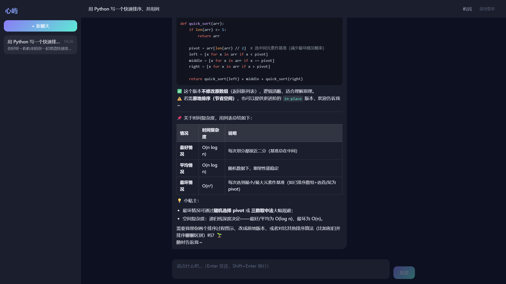
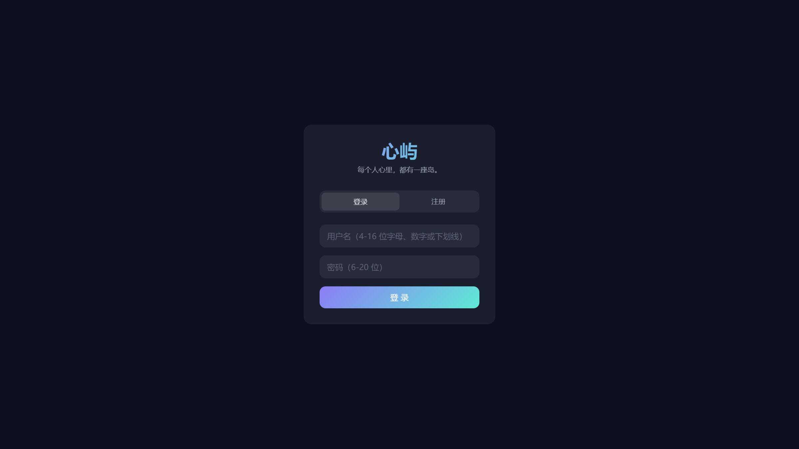
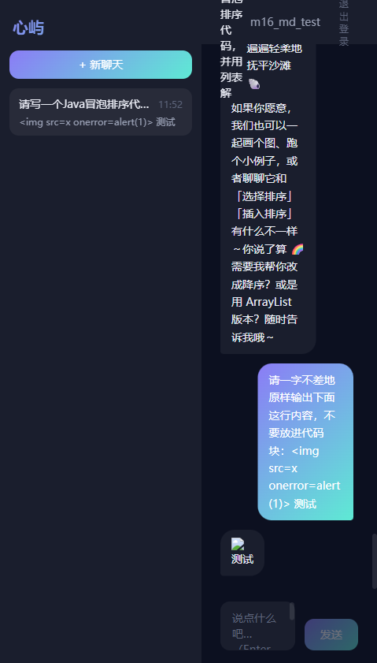
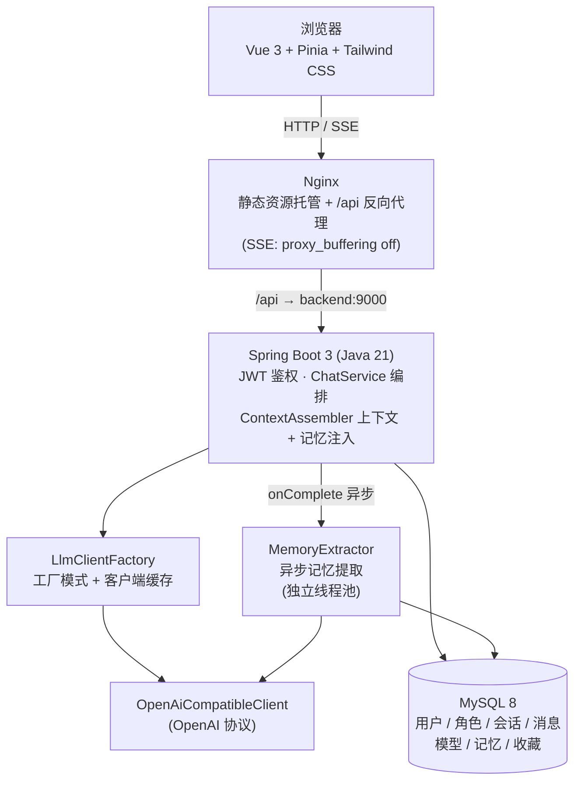
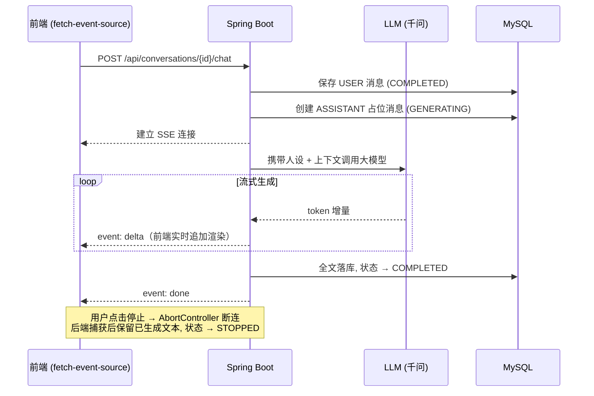
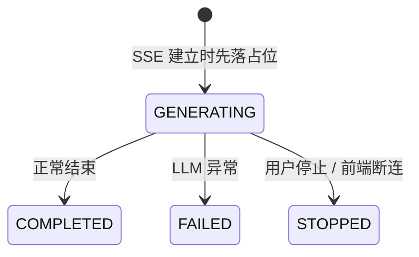

# 心屿 XinYu

> 每个人心里，都有一座岛。

心屿是一款基于 **Spring Boot 3 + Vue 3 + 大语言模型** 的原创 AI 角色聊天平台，支持 **多模型热切换、长期记忆、角色 UGC 广场、SSE 流式回复**，并通过 **Docker Compose 一键部署**（Nginx + Spring Boot + MySQL 三容器编排）。

```bash
docker compose up -d --build   # 一条命令启动整套系统 → http://localhost
```

## ✨ 功能特性

### 核心聊天
- **SSE 流式回复**：Token 级增量返回，边生成边显示，支持随时停止生成
- **消息状态机**：`GENERATING → COMPLETED / FAILED / STOPPED` 全生命周期管理，中断可容错恢复
- **Markdown 渲染**：代码高亮（highlight.js）、列表、表格，DOMPurify 白名单过滤防御 XSS
- **多轮上下文**：角色 System Prompt + 历史 + 当前输入，服务端组装

### 多模型热切换（M2）
- **用户自管理模型**：每个用户可添加任意 OpenAI 兼容模型（Qwen/DeepSeek/GLM/Moonshot/Ollama），API Key 采用 **AES-GCM 加密存储**
- **会话级模型覆盖**：优先级 = 会话级覆盖 > 用户默认模型；聊天顶栏一键切换，无需重新部署
- **工厂模式 + 客户端缓存**：`LlmClientFactory` 按模型配置动态创建 `OpenAiCompatibleClient`，复用连接

### 长期记忆系统（M2.1）
- **自动提取**：每轮 ASSISTANT 完成后，异步从对话中提取结构化记忆（JSON 输出 + 容错解析），独立线程池隔离，失败静默不影响主链路
- **Top-K 注入**：按 importance（HIGH/MEDIUM/LOW）权重截断 Top-5，拼接到 system prompt 末尾
- **同 key 去重**：同 (用户, 角色, memory_key) 已有则更新，避免堆积
- **用户可管理**：记忆管理页支持编辑 / 启停 / 删除，按角色筛选

### 角色 UGC 生态（M2.2 ~ M2.3）
- **角色 CRUD + Prompt 编辑器**：用户自定义人设、开场白、采样温度、maxTokens
- **状态机**：`DRAFT → PUBLISHED → OFFLINE`，草稿仅自己可见，发布后广场可见
- **角色广场**：游客可逛，支持搜索 + 推荐/热门/最新三排序；点击收藏 / 开聊，操作引导登录
- **角色详情页**：模糊头像背景 + 开场白预览 + 悬浮操作栏
- **记忆按 用户 × 角色 隔离**：不同角色不串味

### 用户系统
- 注册 / 登录 / JWT 鉴权 / 接口权限校验 / 数据按用户隔离
- 用量统计：调用次数 + Token 消耗 + 估算成本，实时面板

## 📸 界面预览

**聊天主界面**：三栏布局 · SSE 流式回复 · Markdown 代码高亮 / 表格 / 列表渲染



| 登录页 | XSS 防御（恶意脚本被净化为纯文本） |
|---|---|
|  |  |

## 🏗 系统架构



**部署形态**：`docker compose up -d` 拉起三个容器 —— `xinyu-nginx`（对外唯一入口 80）→ `xinyu-server`（内部 9000，不暴露宿主机）→ `xinyu-mysql`（内部 3306，数据持久化于 named volume，首启自动执行建表+种子脚本）。

## 🔄 SSE 流式对话链路



### ASSISTANT 消息状态机



占位先行 + 状态流转的设计保证了**任何异常路径（模型超时、用户断网、主动停止）都不会产生脏数据**，刷新页面后历史消息始终一致。

## 🧰 技术栈

| 层 | 技术 |
|---|---|
| 前端 | Vue 3.5 · TypeScript · Vite · Pinia · Vue Router · Axios · Tailwind CSS 4 · marked + highlight.js + DOMPurify |
| 后端 | Java 21 · Spring Boot 3.5 · MyBatis-Plus · JWT (jjwt) · SSE (SseEmitter) |
| 数据 | MySQL 8 |
| 模型 | 通义千问 qwen-plus（OpenAI 兼容协议），接口抽象支持多供应商扩展 |
| 部署 | Docker Compose · Nginx · 多阶段镜像构建（Maven / Node 构建层 + 轻量运行层） |

## 🚀 快速开始

### 方式一：Docker 一键部署（推荐）

前置：安装 [Docker Desktop](https://www.docker.com/products/docker-desktop/)（或 Linux 下 Docker Engine + Compose 插件）。

```bash
# 1. 准备环境变量（数据库密码 / JWT 密钥 / 千问 API Key）
cp .env.example .env   # Windows: copy .env.example .env
#    编辑 .env 填入三个值, API Key 到阿里云百炼申请: https://bailian.console.aliyun.com/

# 2. 一键构建并启动（首次构建需拉取基础镜像, 约 3~5 分钟）
docker compose up -d --build

# 3. 浏览器打开
http://localhost
```

MySQL 首次启动自动执行 `deploy/mysql/init/01-schema.sql`（10 张表 + 官方角色种子数据），无需手动建库。停止：`docker compose down`（数据保留在 named volume）。

### 方式二：本地开发模式

开发环境使用 `dev` profile，LLM 为 Mock 实现（**无需 API Key，零成本联调**）。

```bash
# 后端（需本机 MySQL 8, 参照 application-example.yml 建 application-dev.yml）
cd xinyu-server && mvn spring-boot:run -Dspring-boot.run.profiles=dev   # :9000

# 前端（/api 自动代理到 9000）
cd xinyu-web && npm install && npm run dev                              # :5180
```

## 📁 项目结构

```
xinyu/
├── xinyu-web/            前端（Vue3 + TS + Vite, 含 Dockerfile: Node 构建 → Nginx 托管）
├── xinyu-server/         后端（Spring Boot 3 + Java 21, 含 Dockerfile: Maven 构建 → JRE 运行）
│   └── src/main/java/com/xinyu/
│       ├── auth/         注册登录 + JWT 签发校验
│       ├── chat/         聊天编排（ChatService / ContextAssembler / SSE）
│       ├── llm/          LlmClient 抽象 + LlmClientFactory 工厂 + OpenAi 兼容客户端
│       ├── memory/       长期记忆（提取 / 注入 / CRUD）
│       ├── character/    角色 UGC（CRUD + 状态机 + 广场 + 收藏）
│       ├── conversation/ 会话管理
│       ├── message/      消息持久化 + 状态机
│       ├── stats/        用量统计
│       └── common/       安全（AES / JWT / 鉴权过滤器）+ 异常 + 配置
├── nginx/nginx.conf      反向代理配置（SSE 关闭缓冲 / SPA fallback / 静态资源缓存）
├── deploy/mysql/init/    容器 MySQL 自动初始化脚本（建表 + 种子数据）
├── docker-compose.yml    三容器编排（nginx / backend / mysql）
├── .env.example          环境变量模板
└── docs/                 设计文档 + 截图
```

## 🔌 API 概览

| 方法 | 路径 | 说明 |
|---|---|---|
| POST | `/api/auth/register` | 注册（成功即签发 JWT） |
| POST | `/api/auth/login` | 登录 |
| GET | `/api/users/me` | 当前用户信息 |
| GET / POST | `/api/conversations` | 会话列表 / 创建会话 |
| GET | `/api/conversations/{id}/messages` | 历史消息 |
| POST | `/api/conversations/{id}/chat` | 发送消息并建立 **SSE 流式**回复 |
| GET / POST / PUT / DELETE | `/api/models` | 模型 CRUD（用户自管理） |
| PUT | `/api/conversations/{id}/model` | 会话级模型覆盖 |
| GET / PUT / DELETE | `/api/memories` | 长期记忆管理 |
| GET / POST / PUT / DELETE | `/api/characters` | 角色 CRUD |
| GET | `/api/characters/square` | 角色广场（游客可访问） |
| POST / DELETE | `/api/characters/{id}/favorite` | 收藏 / 取消收藏 |
| GET | `/api/stats/usage` | 用量统计 |

除 `/api/auth/**`、`/api/characters/square`、`/api/characters/*/detail` 外所有接口需携带 `Authorization: Bearer <token>`。

## 💡 工程亮点

1. **多模型热切换架构** —— `LlmClientFactory` 工厂模式按模型配置动态创建 `OpenAiCompatibleClient`，支持 5+ 供应商（Qwen/DeepSeek/GLM/Moonshot/Ollama）；API Key 采用 **AES-GCM 加密存储**（自带认证防篡改）；会话级模型覆盖优先级 = 会话 > 用户默认，聊天顶栏一键切换无需重新部署。
2. **长期记忆系统** —— 每轮对话后异步提取结构化记忆（JSON 输出 + 容错解析，兼容 markdown 代码块包裹），按 importance Top-K 注入 system prompt；独立线程池 `memoryExecutor` 与 SSE 线程池隔离，DiscardPolicy 队列满静默丢弃；同 (用户, 角色, memory_key) 去重避免堆积。
3. **角色 UGC 全闭环** —— CRUD + 状态机（DRAFT/PUBLISHED/OFFLINE）+ 广场搜索（推荐/热门/最新三排序）+ 收藏（幂等 upsert/delete + 冗余计数 GREATEST 下限保护）；游客可逛操作引导登录，记忆按 用户×角色 隔离不串味。
4. **SSE 全链路打通** —— 后端 `SseEmitter` 异步输出、Nginx `proxy_buffering off` 防缓冲截流、前端 `fetch-event-source` 增量消费 + `AbortController` 停止生成，三层协同。
5. **消息状态机容错** —— ASSISTANT 消息先落 `GENERATING` 占位再生成，异常/停止路径均有终态，杜绝半途中断产生的脏数据。
6. **AI 输出安全** —— 模型输出视为不可信输入：marked 渲染 → DOMPurify 白名单过滤 → v-html 展示，恶意 `<script>`/`onerror` payload 均被净化。
7. **镜像安全与效率** —— 多阶段构建减小体积；`.dockerignore` 排除含密钥的本地配置文件，敏感信息全部经环境变量注入（`.env` 不入库）；MySQL/后端容器不暴露宿主机端口，Nginx 为唯一入口。

## 📄 更多文档

- [技术设计文档](docs/design.md)
- [M1-4 前后端接口契约](docs/m1-4-contract.md)
